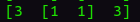
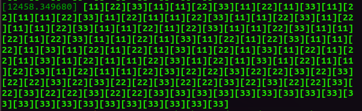

# Assignment of Real-Time Operating Systems

## Task

(1) Design an application with 3 threads, whose periods are 300ms, 500ms, and 800ms.

(2) The threads shall just "waste time", as we did in the exercise with threads.

(3) Design a simple driver with only open, close, write system calls.

(4) During its execution, every tasks

 	(i) opens the special file associated with the driver;

 	(ii) writes to the driver its own identifier plus open square brackets (i.e., [1, [2, or [3)

 	(iii) close the special files

 	(iv) performs operations (i.e., wasting time)

 	(v) performs (i)(ii) and (iii) again in order to write to the driver its own identifier, but with closed square 	brackets (i.e., 1], 2], or 3]).

(5) The write system call simply writes on the kernel log the string that was received from the thread. A typical output of the system, by reading the kernel log, may be the following [11][2[11]2][3[11]3] . This clearly shows that some threads can be preempted by other threads (if this does not happen, try to increase the computational time of longer tasks).

(6) Finally, modify the code of all tasks in order to use semaphores. Every thread now protects all its operations (i) to (v) with a semaphore, which basically prevents other tasks from preempting it. Specifically, use semaphores with priority ceiling.

## Building

- you become superuser - root

  ```
  sudo su
  ```

- compile the driver with

  ```
  make
  ```

which will produce a file simple.ko (have a look at the Makefile before doing that)

- install the kernel module

  ```
  insmod simple.ko 
  ```

- You can fine the major number of your driver. (for example : simple 509)

  ```
   cat /proc/devices
  ```

- make special file

  ```
  mknod /dev/simple c <majornumber> 0 
  ```

- execute the main file

  ```
  g++ task6.c (or task1_5.c) -pthread -o task6 (or task6.c) 
  ./task6 (task1_5)
  ```


## Content description

### task1-5 (file name : task1_5.c) which write characters without semaphore

- Design an application with 3 threads, whose periods are 300ms, 500ms, and 800ms.

- Design a simple driver with only open, close, write system calls.

  1. opens the special file associated with the driver

  2. writes to the driver its own identifier plus open square brackets (i.e., [1, [2, or [3)

  3. performs operations (i.e., wasting time)

  4. performs (i)(ii) and (iii) again in order to write to the driver its own identifier, but with closed square brackets (i.e., 1], 2], or 3]).

     

  #### Result

  - You can check the kernel log or execute read.c. 

    But threads can by preempted by other threads like the following picture.
  
    ```
  dmesg (or g++ read.c -o read.c & ./read)
    ```

    

    

    

    

    

### task6  (file name : task6.c) which write characters with semaphore

- Finally, modify the code "task1_5"  in order to use semaphores. Every thread now protects all its operations (i) to (v) with a semaphore, which basically prevents other tasks from preempting it. Specifically, use semaphores with priority ceiling.

  #### Priority Ceiling

  - It is a synchronization protocol for shared resources to prevent deadlocks due to priority reversal, which is the phenomena high-priority processes are kept waiting by low-priority processes.
  - Each semaphore 𝑆_𝑘 is assigned a priority upper bound 𝐶(𝑆_𝑘) equal to the highest priority of the tasks that can lock it.

-  in order to use priority ceiling in POSIX, I use Priority Protect Protocol. 

   ```
   //initialize attribute
   pthread_mutexattr_init(&mutexattr_prioceiling);
   pthread_mutexattr_getprotocol(&mutexattr_prioceiling, &mutex_protocol);
   
   // set the protocol attribute of mutex created by the function
   pthread_mutexattr_init()
   
   //set the PTHREAD_PRIO_PROTECT
   pthread_mutexattr_setprotocol(&mutexattr_prioceiling, PTHREAD_PRIO_PROTECT);
   
   // set to a priority ceiling which is the highest priority among all the threads that may lock that mutex.
   pthread_mutexattr_setprioceiling(&mutexattr_prioceiling,priomax.sched_priority);
   
   //initialize mutex
   pthread_mutex_init(&task123_mutex, &mutexattr_prioceiling);
   
   ```


	#### Result




